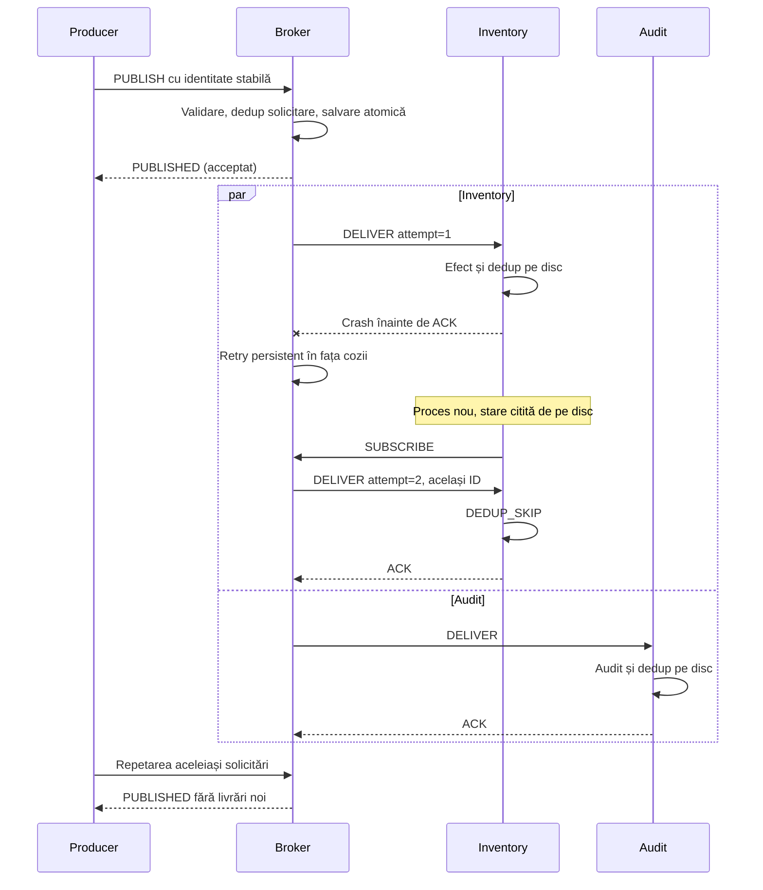

# Diagramă de secvență

Sursa Mermaid este [sequence.mmd](sequence.mmd).
Inventory și Audit rulează independent; ordinea globală între ele nu este garantată.

```mermaid
sequenceDiagram
    participant P as Producer
    participant B as Broker
    participant I as Inventory
    participant A as Audit
    P->>B: PUBLISH cu identitate stabilă
    B->>B: Validare, dedup solicitare, salvare atomică
    B-->>P: PUBLISHED (acceptat)
    par Inventory
        B->>I: DELIVER attempt=1
        I->>I: Efect și dedup pe disc
        I--xB: Crash înainte de ACK
        B->>B: Retry persistent în fața cozii
        Note over I: Proces nou, stare citită de pe disc
        I->>B: SUBSCRIBE
        B->>I: DELIVER attempt=2, același ID
        I->>I: DEDUP_SKIP
        I-->>B: ACK
    and Audit
        B->>A: DELIVER
        A->>A: Audit și dedup pe disc
        A-->>B: ACK
    end
    P->>B: Repetarea aceleiași solicitări
    B-->>P: PUBLISHED fără livrări noi
```
